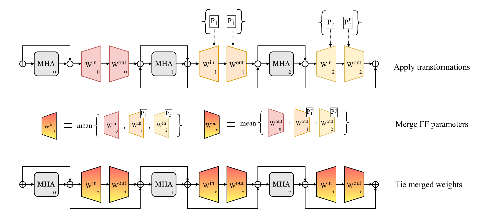

# Merging Feed-Forward Sublayers for Compressed Transformers

This repository contains the code for the paper "Merging Feed-Forward Sublayers for Compressed Transformers". We are actively in the process of updating this repository. 



## Getting Started

### Dependencies

We recommend creating a new virtual environment, and installing the following dependencies:
 
```
pip install -r requirements.txt
```

### Data
We only need to download the OPUS dataset for this project. Other datasets are available via the huggingface hub. We source this data from the 07-28-2020 release of the Tatoeba Challenge dataset, available [here](https://github.com/Helsinki-NLP/Tatoeba-Challenge/blob/d34a89ac102fd236503a1911dd1050564bf4e682/data/subsets/v2020-07-28/highest.md). 

```
wget https://object.pouta.csc.fi/Tatoeba-Challenge-v2020-07-28/eng-zho.tar
tar -xvf eng-zho.tar
cd data/release/v2020-07-28/eng-zho
gunzip train.src.gz # eng
gunzip train.trg.gz # zho
python src/convert_opus_to_hf.py --path .
```

### Code Contents

#### Src contents

Key files in src include:
1. get_corrs.py: script to compute the correlation between sublayers. Can input model_type, reference layer or layer_range, maximum tokens 
2. merge_ffs.py: script to merge feed-forward sublayers. Can input model_type, reference layer or layer_range
3. utils.py : utility functions for the above scripts. This file also contains functions for incorporating additional model types.
4. drop_layers.py: Script to drop layers from a model for our layer-pruning baseline.

## Experiments

### Obtaining Models  

All models used are available on the Huggingface Hub. Some models and their datasets may require approval via the Huggingface Hub, and a corresponding HF token for access. 

### Compressing Models

#### Pre-tune

Example experiments for gpt2 and vit are found in ``experiment/main/run_${model}_notune.sh``. Example use is
```
run_${model}_notune.sh $outdir $num_toks $start_index $end_index $evaluation_split
```

#### Tuning

Main tuning scripts coming soon

OLMo's tuning script is found at ``src/olmo/ft_olmo_sum.py`` for the QLoRA extension. 

### Evaluation

We include a different evaluation script for each model type. For including your own model for evaluation, please add a new script in the ``src/eval/`` directory.

```
# evaluate VIT model

# evaluate GPT-2 model

# evaluate OPUSMT model

```

### Similarity Analysis

We include a script to compute the similarity between model sublayers. The resulting file is saved in the output directory, and is a json file with CKA results between all layer indices, for both attention and feed-forward sublayers. 

```
bash get_all_sims.sh $output_dir 
```

To plot a CKA map from the resulting json file, use the following command: 

```
python plot_cka.py --file $output_dir/sims_10000_linear_updated.json --component {attention or ff} --model-name {vit, gpt2, opusmt}
```
### Acknowledgements

#### AI Assistance
This code was developed with the assistance of OpenAI's ChatGPT, as well as Copilot.
