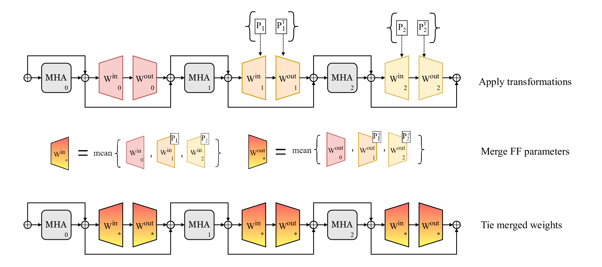

# Merging Feed-Forward Sublayers for Compressed Transformers

This repository contains the code for the paper "Merging Feed-Forward Sublayers for Compressed Transformers", in [TMLR 2026](https://openreview.net/forum?id=t8iuiH46g0). 


## Getting Started

### Dependencies

We recommend creating a new virtual environment, and installing the following dependencies:
 
```
pip install -r requirements.txt
```

The OLMo3-7B QLoRA experiments (Section 4.5) require a newer stack (transformers 5, `trl`, etc.) that is incompatible with the pins above. Install those in a **separate** environment:

```
pip install -r requirements-olmo3.txt
```

### Data
We only need to download the OPUS dataset for this project. Other datasets are available via the huggingface hub. We source this data from the 07-28-2020 release of the Tatoeba Challenge dataset, available [here](https://github.com/Helsinki-NLP/Tatoeba-Challenge/blob/d34a89ac102fd236503a1911dd1050564bf4e682/data/subsets/v2020-07-28/highest.md). 

```
wget https://object.pouta.csc.fi/Tatoeba-Challenge-v2020-07-28/eng-zho.tar
tar -xvf eng-zho.tar
cd data/release/v2020-07-28/eng-zho
gunzip train.src.gz # eng
gunzip train.trg.gz # zho
python src/convert_opus_to_hf.py --path .
```

### Code Contents

#### Src contents

Key files in `src/`:

- `get_corrs.py`: compute activation correlations between FF sublayers. Takes `--model-name`, a `--reference` layer or `--layer-range`, and `--max-toks`.
- `merge_ffs.py`: align, merge, and tie FF sublayers. Takes `--model-type`, `--encoder-layers`/`--decoder-layers`, `--corrs`, and `--ref-type {first,middle,last}` (the anchor layer).
- `utils.py`: shared utilities and the per-model parameter registry (`model_param_names`); add new model types here.
- `drop_layers.py`: layer-pruning baseline.
- `convert_opus_to_hf.py`: convert OPUS/Tatoeba data to HF format (see Data above).
- `run_benchmark.py`: throughput / max-batch-size benchmarking (Table 7).

Per-model directories hold the recovery fine-tuning scripts and any model-specific helpers:

- `vit/finetune_vit.py`, `gpt2/finetune_gpt2.py`, `olmo/ft_olmo1b.py`, `opusmt/finetune_opusmt.py`
- `olmo3/ft_olmo3.py`: OLMo3-7B QLoRA fine-tuning, `--task {samsum,narrativeqa,hotpotqa}`
- `eval/`: one evaluation script per model type
- `sim_analysis/`: CKA similarity analysis


## Experiments

### Obtaining Models  

All models used are available via the huggingface hub. 

### Compressing Models

Our method has three steps: (1) compute activation correlations between FF sublayers with `get_corrs.py`, (2) merge and tie a window of adjacent FF sublayers with `merge_ffs.py`, and (3) recover performance with a short fine-tune. Sublayer selection (Algorithm 1) is a sliding window: run the merge over each candidate window and keep the best on validation data.

Encoder models (e.g. ViT) merge with `--encoder-layers`; decoder models (e.g. GPT-2, OLMo) use `--decoder-layers` with `--reference-only --transpose`.

#### Main experiments

ViT example (see `experiment/main/run_vit_notune.sh` for the complete script):

```
# 1. correlations across all FF sublayers
python src/get_corrs.py --model-name vit --layer-range 0-11 --max-toks 10000 --outdir $dir
# 2. merge + tie FF sublayers start..end, anchored on the first
python src/merge_ffs.py --model-type vit --encoder-layers ${start}-${end} \
    --corrs $dir/corrs_10000_0-11.pt --ref-type first --output $dir
# 3. recovery fine-tuning
python src/vit/finetune_vit.py --model $dir --tie-ff ${start}-${end} --outdir $ft_dir --num-updates 50000
```

GPT-2 example (see `experiment/main/run_gpt2_notune.sh`):

```
python src/get_corrs.py --model-name gpt2-large --reference $start --max-toks 10000 --outdir $dir
python src/merge_ffs.py --model-type gpt2-large --decoder-layers ${start}-${end} \
    --corrs $dir/corrs_10000_ref_${start}.pt --reference-only --ref-type first --transpose --output $dir
python src/gpt2/finetune_gpt2.py --model $dir --large --tie-ff ${start}-${end} --outdir $ft_dir
```

The remaining models follow the same pattern: OLMo-1B (`--model-type olmo1b`, `src/olmo/ft_olmo1b.py`) and OPUS-MT, which is merged in the encoder and decoder together (`--encoder-layers` and `--decoder-layers` in `merge_ffs.py`, `--enc-tie-ff`/`--dec-tie-ff` in `src/opusmt/finetune_opusmt.py`).

#### Alternative anchor layers

To reproduce the anchor ablation (Table 4), change the anchor layer with `--ref-type {first,middle,last}` in `merge_ffs.py`:

```
python src/merge_ffs.py --model-type vit --encoder-layers ${start}-${end} \
    --corrs $dir/corrs_10000_0-11.pt --ref-type middle --output $dir
```

#### Alternative layer ranges

To reproduce the layer-selection results (Table 3, Figure 5), merge different windows by varying `--encoder-layers`/`--decoder-layers` (keeping the window size `k` fixed) and evaluate each. Running the pipeline above over every window produces the selection curves.

#### QLoRA extension

The OLMo3-7B experiments (Section 4.5) use the separate environment (`requirements-olmo3.txt`); all scripts live in `src/olmo3/`.

```
# merge FF sublayers of the OLMo3 base model
python src/merge_ffs.py --model-type olmo3 --decoder-layers ${start}-${end} \
    --corrs $dir/corrs.pt --ref-type first --output $merged
# QLoRA recovery fine-tune on a downstream task
python src/olmo3/ft_olmo3.py --task {samsum,narrativeqa,hotpotqa} --model $merged --tie-ff ${start}-${end} \
    --qlora --lora-r 8 --lora-a 16 --lora-modules all-linear --num-updates 3000 --outdir $ft_dir
```

Pre-fine-tune model selection uses Wikitext-103 perplexity (`src/eval/eval_olmo3.py`). The `finetune_*.sh` and `run_all_*.sh` wrappers in `src/olmo3/` reproduce the baseline / merge / drop runs.

### Evaluation

We include a different evaluation script for each model type. For including your own model for evaluation, please add a new script in the ``eval/`` directory.

```
# ViT (accuracy)
python src/eval/eval_vit.py --model $model --split $split

# GPT-2 (perplexity)
python src/eval/eval_ppl.py --model-type gpt2-large --model-path $model --split $split

# OLMo-1B (perplexity)
python src/eval/eval_olmo.py --model $model --split $split

# OPUS-MT (BLEU / COMET)
python src/eval/eval_mt.py --model $model --split $split --outfile $out

# OLMo3-7B downstream (ROUGE for SamSum/NarrativeQA, EM+F1 for HotPotQA)
python src/olmo3/eval/eval_samsum.py --model $adapter --split test
python src/olmo3/eval/eval_narrativeqa.py --model $adapter --split test
python src/olmo3/eval/eval_hotpotqa.py --model $adapter --split validation
```

For the quantization results (Section 5.4), the ViT, GPT-2, OLMo-1B, and OPUS-MT eval scripts accept `--quantize` to apply LLM.int8() at evaluation time.

### Similarity Analysis

We include a script to compute the similarity between model sublayers. The resulting file is saved in the output directory, and is a json file with CKA results between all layer indices, for both attention and feed-forward sublayers. 

```
cd sim_analysis
bash get_all_sims.sh $output_dir 
```

To plot a CKA map from the resulting json file, use the following command: 

```
python plot_cka.py --file $output_dir/sims_10000_linear_updated.json --component {attention or ff} --model-name {vit, gpt2, opusmt}
```
### Acknowledgements

#### AI Assistance
This code was developed with the assistance of OpenAI's ChatGPT, as well as Copilot.

### Citation

If you found this work or code helpful, please cite:

```bibtex
@article{
verma2026merging,
title={Merging Feed-Forward Sublayers for Compressed Transformers},
author={Neha Verma and Kenton Murray and Kevin Duh},
journal={Transactions on Machine Learning Research},
issn={2835-8856},
year={2026},
url={https://openreview.net/forum?id=t8iuiH46g0},
note={}
}
```